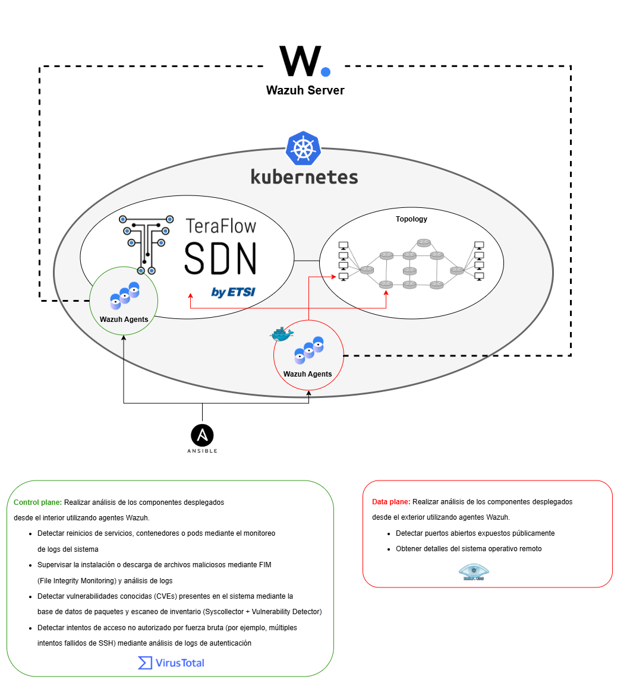

# Wazuh

## Scenario

## wazuh-server-docker

Despliega todos los componentes de wazuh en Docker. Versión 4.12: https://documentation.wazuh.com/current/deployment-options/docker/wazuh-container.html. https://github.com/wazuh/wazuh-docker

La única modificación añadida es el fichero: \wazuh-server-docker\single-node\config\local_rules.xml. Permite hacer la lectura de lo que obtienen los agentes con el escaneo de nmap.

Credenciales:

admin/SecretPassword

## wazuh-agent-docker

Construye una imagen de docker de Ubuntu 20.04 con la configuración de un agente que se enlaza al servidor con la IP: WAZUH_MANAGER="192.168.159.32"

Se siguen las guías: https://documentation.wazuh.com/current/installation-guide/wazuh-agent/wazuh-agent-package-linux.html
https://wazuh.com/blog/nmap-and-chatgpt-security-auditing/

Para construir la imagen: 
~~~
docker build -t wazuh-agent-nmap:latest .
~~~

## wazuh-agent-k8s

Despliegue en k8s de los agentes:

~~~
k apply -f agent-nmap-deployment.yaml
~~~

### deployment-ansible

Despliegue dentro de componentes ya desplegados utilziando ansible. Seguir la guía y crear un playbook para automatizarlo: https://documentation.wazuh.com/current/installation-guide/wazuh-agent/wazuh-agent-package-linux.html

### deployment-k8s

Despliegue de un pod que realizará el escaneo de nmap. Usará la imagen construida con Docker.

## wazuh-agent-tfs

Instalación de agente de wazuh en VM TFS automaticamente